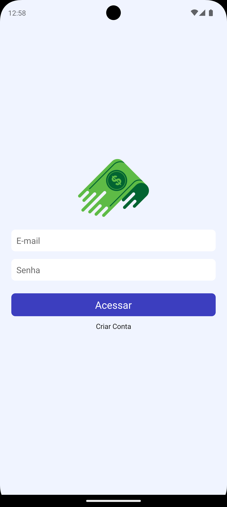
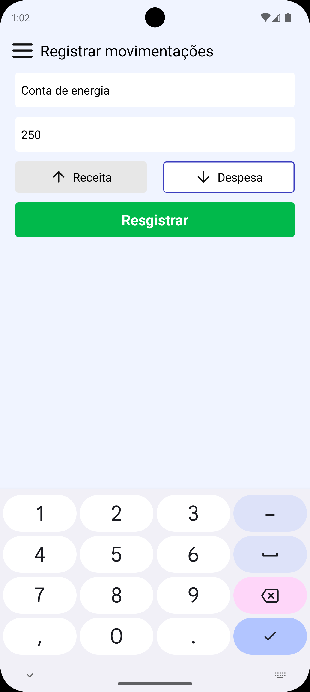
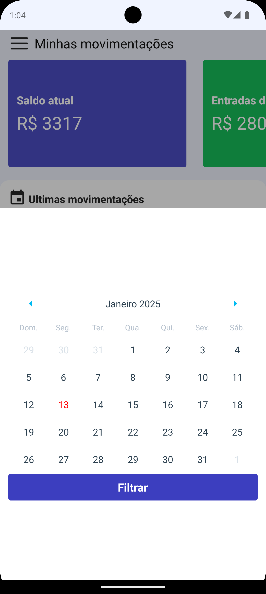

# Gerenciamento de Finanças Pessoais - AppFinancas

Este é um aplicativo de gerenciamento de finanças pessoais desenvolvido com React Native e Expo, projetado para ajudar os usuários a controlar suas finanças de forma prática e eficiente. O app permite o cadastro de despesas, receitas e a visualização de movimentações financeiras de forma simplificada.

## Funcionalidades

- Cadastro e Login: Permite aos usuários criar uma conta e fazer login para acessar suas informações financeiras de forma segura.
- Cadastro e exclusão de Despesas e Receitas: O usuário pode adicionar e remover entradas de receitas e saídas de despesas, controlando suas finanças com facilidade.
- Cards de Movimentações: Cards interativos exibem as movimentações diárias, incluindo o saldo de entradas e saídas.
- Filtro por Data: Utilizando um calendário, é possível filtrar as entradas e saídas para um período específico, facilitando a visualização das finanças em diferentes períodos.
- Visualização de Saldo: Mostra o saldo atualizado de acordo com as entradas e saídas registradas.

## Tecnologias Utilizadas

- React Native
- Styled Components
- Axios
- React native calendar
- React native gesture handler
- React native reanimated

## Como iniciar o projeto

#### Clone o repositorio
```bash 
git clone https://github.com/leandrovelosos/AppFinancas.git
```
#### Instale as dependencias
```bash
yarn install
```
#### Clone e configure o backend em
```bash
https://github.com/devfraga/backend-financas?tab=readme-ov-file#backend-finan%C3%A7as-app
```
#### Inicie o projeto
```bash
yarn start
```

## App

<br/>
<br/>

<br/>
<br/>

<br/>
<br/>



